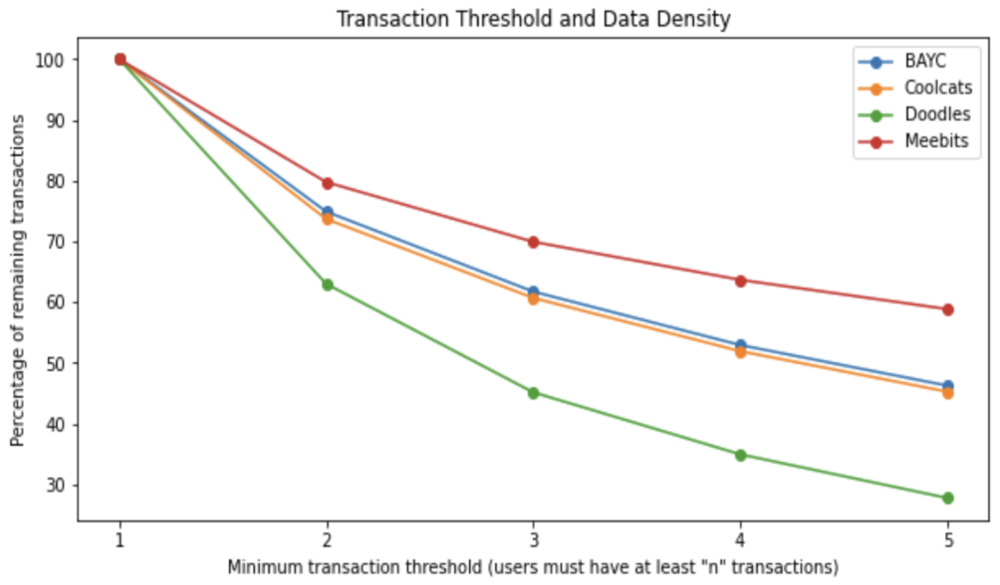
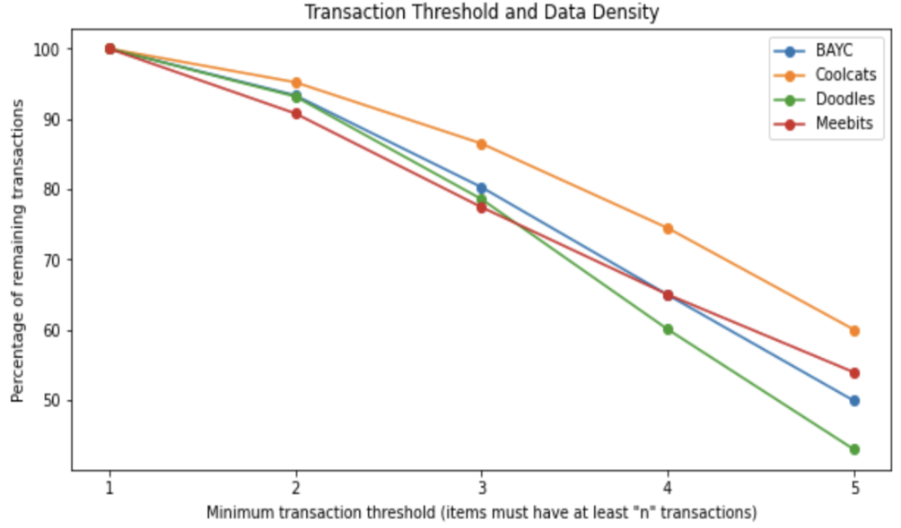
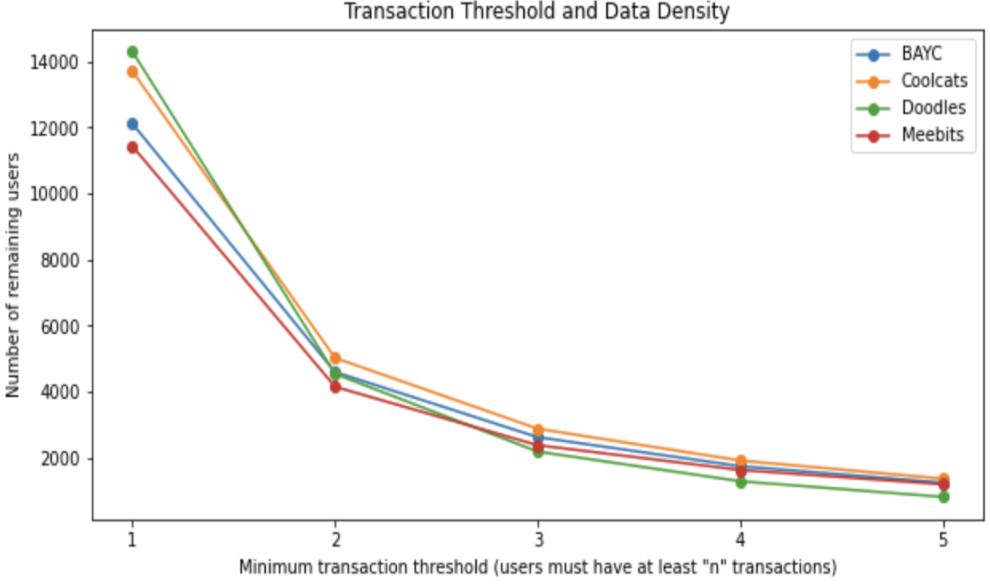
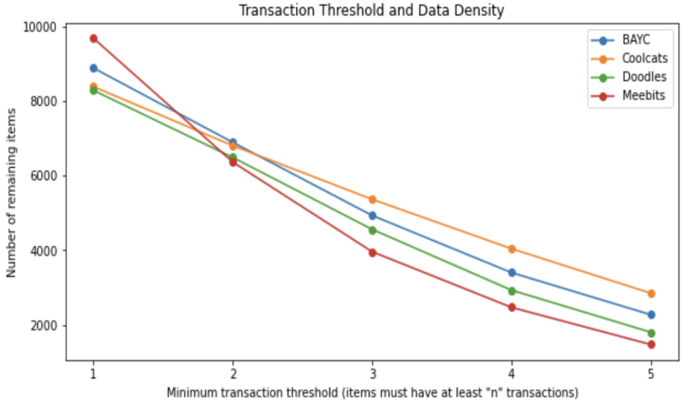
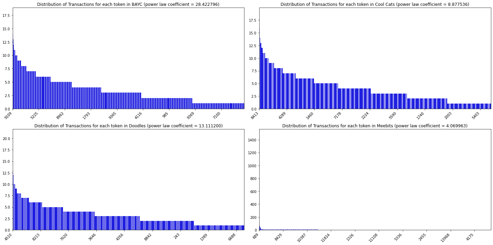
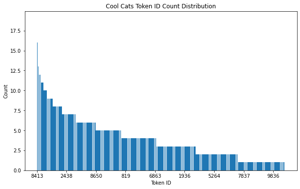
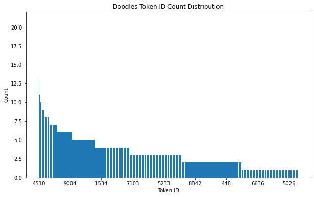
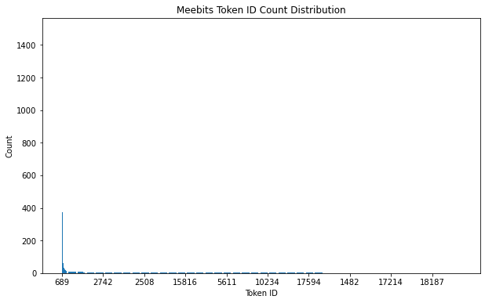
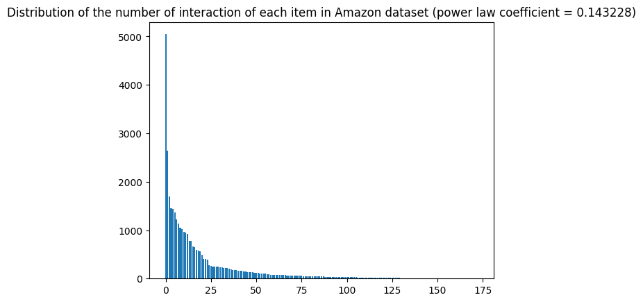
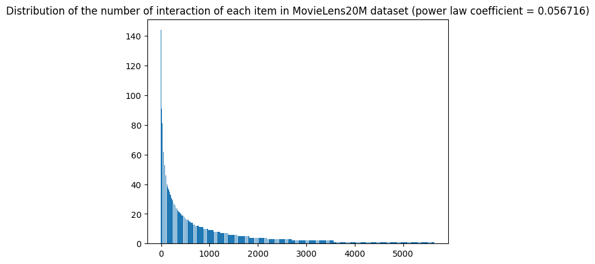

# 1. Data Description

## 1.1. Overview

In our study, we focus on the four top-ranked ERC-721 based NFT collections, which are Bored Apes Yacht Club (BAYC), Cool Cats, Doodles, Meebits, in terms of market capitalisation as of August 2022 according to DappRadar. We collected content features using OpenSea API and transaction data from Etherscan NFT tracker and web3.py, covering the entire period between 1st September 2021 and 10th March 2023. Our dataset consists of implicit feedback and considers purchase history as user-item interactions. We implemented a minimum threshold of five interactions for items in our user-item matrices and incorporated item and user features to enhance the predictive power. The data includes 4,575 users, 25,014 items, and 56,981 interactions across all four collections.  
 

The number of users, items and interactions for each collection used for the experiment. 
| collection | users | items | interactions |
|-------|------|------|-------------|
| BAYC  | 1230 | 6726 | 13737 |
| Coolcats | 1357 | 6824 | 14890 |
| Doodles | 804 | 4771 | 7250 |
| Meebits | 1184 | 6693 | 21104 |
 

## 1.2. Evaluating Data Density and Transaction Thresholds

We explore our dataset by evaluating its data density and transaction thresholds as determining the optimal transaction threshold is one of the critical steps in designing effective recommender systems. Below analyses were done with complete set of transactions. 

 

- **Number of transaction left after transaction threshold on users**

    
    

 
 

- **Number of transactions left after transaction threshold on items**

    
    

 
 

- **Number of users left after user threshold**

    
    

 
 

- **Number of items left after item threshold**

    

 
    

## 1.3. Power law distribution

Power law distributions provide insights into the relative popularity and concentration of tokens in a dataset. To gain a deeper understanding of our dataset, we analyze its power law distribution and compare it to a benchmark dataset. This comparison enables us to gauge the alignment of our dataset with standard patterns and to identify any distinctive characteristics. For a fair comparison, we have selected a random sample of 14,000 interactions from the benchmark dataset, which corresponds to the average number of interactions in our dataset.
  
 
1. Our dataset
 
  
 

<!-- - Cool cats 

 

- Doodles 

 

- Meebits 

  -->

2. Benchmark datasets 
 

- Amazon 

 

- MovieLens20M 

 

The distribution for our datasets shows a weaker power law distribution compared to a benchmark dataset, suggesting that the popularity of items in our dataset is more evenly distributed. This could potentially make the recommendation task more challenging if relying solely on the collaborative filtering method. In a context where popularity serves as a straightforward and effective indicator for recommendations, it becomes less informative in our dataset due to this more evenly distributed popularity. 
 

## 1.4. Token price movement

In order to incorporate price movement labels for multi-task learning, we have conducted an examination of the price movements for each token. We compute the label by examining the price difference between the current transaction and the one that follows. The label is binary: '1' signifies an expected price increase in the next transaction, while '0' denotes either a price decrease or situations where subsequent transactions don't exist for comparison. The columns in the table represent the following: the number of tokens for which the latest transaction price is greater than the initial transaction price, the number of tokens for which the latest transaction price is greater than the mean of the remaining transaction prices, and the number of tokens for which the mean of the second half of the transaction prices is greater than the mean of the first half of the transaction prices. In the table, each row represents a collection, and the values indicate the percentage of tokens that exhibit the respective price movements. 

 

| Token      | Latest Price > First Price | Latest Price >Avg. Price (Excluding Last) | Avg. Price (First Half) < Avg. Price (Last Half) |
|------------|-------------------------------|--------------|--------------|
| BAYC       | 59%                         | 61%       | 59% |
| Cool Cats  | 47%                         | 47%         | 50% |
| Doodles    | 58%                          | 48%        | 59% |
| Meebits    | 45%                          | 45%         |47% | 

  

# 2. Side information preparation

## 2.1. Item features
### Image
To extract features from the NFT images, we employ DenseNet, a deep convolutional network known for its efficiency and effectiveness in various image recognition tasks. The images are first standardized to a shape of 128 * 128 * 3, where 3 represents the RGB colour spectrum. Then the model returns embeddings of size 1024 for each image. 
 
### Text
The text data for each item is comprised of discrete words each describing each of the visual properties like ‘Background colour’, ‘body’, ‘outfit’, and ‘hair’. Items within the same collection share the same types of visual properties whereas they tend to vary across collections. Cool cats, for example, is a collection of blue cat avatars with each artwork possessing a unique body, hat, face, and outfit, whereas Bored Ape Yacht Club is a collection of monkey avatars having a slightly different types of properties like ‘fur’. Among all, we only have considered six types of properties with the fewest missing values for each collection apart from Cool cats, for which we considered all available 5 types of properties for generating item embeddings. 

We processed each descriptive word into embeddings using a pre-trained [BERT](https://huggingface.co/bert-base-uncased) model. Specifically, for each word, we tokenized the text and converted it into input tokens, and then fed it into the BERT model to get the embeddings. The embeddings of all tokens in an entry were averaged to get an embedding for the entire entry. For example, for an entry like 'short red hair' for 'Hair', we tokenized it into 'short', 'red', 'hair', obtained the embeddings for each token, and then averaged them to get a single embedding for the entire entry.

Each entry's embedding was then concatenated with other embeddings related to the same item. Hence, each item's embedding size was 768 multiplied by the number of visual traits considered. For example, if we considered 6 visual traits and used the BERT base model, each item's embedding size would be 768*6=4608. 
 
### Price
For the price feature, we created a empty vector length of 768, equivalent of the entire transaction days and filled it with the sold price on the corresponding date when the transaction happens. We have only considered selling price in Ethereum (ETH), Wrapped Ethereum (WETH), and Blur Pool due to valuation issues and prices quoted in other currencies like USDC and DAI were replaced with 0. Where there are multiple sales for a token in a day, we used the average purchase price for that day. 

### Transaction
The frequency of transactions associated with a particular item can be indicative of its popularity. For the transaction feature, we used the same method as price feature but filled the values with the number of transactions happened in that day. 
 

## 2.2. User features
### Price
The purchase price of each user was used to represent the user’s financial capability and willingness to pay for NFTs, calculated in the same manner as the price feature of items. 
 

### Transaction count
We use each wallet address’s transaction count to provide insight into the user's trading behavior. This feature was calculated in the same manner as the transaction feature of items. 
 

## 2.3. Price movement label
We generate price movement label to represent the change in the price of a token between two transactions. The purpose of this feature is to classify whether the price of a token is going to increase or not in the next transaction. We calculate the price difference of each token between the current and subsequent transaction and label it 1 for upward movement, 0 for downward movement or any instances where no subsequent transactions are available for comparison. This kind of information can be valuable in predicting user behavior, as users may behave differently based on whether they anticipate a price increase. 

